# 🎛️ FSC vs Behavioral Cloning

This project compares **Finite State Controllers (FSCs)** and **Behavioral Cloning with LSTMs** in a partially observable gridworld (POMDP).  
The goal is to understand the trade-off between **interpretability** and **performance** when learning from trajectories generated by a recurrent RL expert.

## 📋 Project Overview

- **Environment**: custom POMDP gridworld with partial observations (4 binary wall sensors).
- **Expert policy**: Recurrent PPO (LSTM-based) used to generate demonstrations.
- **Compared models**:
	- FSC trained with trajectory likelihood optimization.
	- LSTM trained with supervised Behavioral Cloning over the same trajectories.
- **Maze scales**: 3x3, 6x6, 9x9.
- **Evaluation focus**: success rate, average reward, average steps, inference cost, robustness, and interpretability.

## 🧪 Key Experiments

| Experiment | Description |
|------------|-------------|
| Recurrent PPO Training | Train expert agents per maze size and save best checkpoints |
| Trajectory Collection | Build demonstration datasets from expert rollouts |
| FSC Training Sweep | Train FSC with different numbers of internal states \(M\) |
| BC-LSTM Training | Train sequence model to imitate expert actions |
| Quantitative Comparison | Compare success rate, reward, and episode length |
| Trajectory Visualization | Build 3x3 comparison GIFs across models and sizes |
| Robustness Analysis | Evaluate behavior under action noise/randomness |
| Interpretability | Visualize FSC internal states and transitions |

## 🚀 Quick Start

### 📦 Installation

```bash
pip install -r requirements.txt
```

### ▶️ Main Pipeline

⚠️ WARNING: Full training can take a long time. In most cases, it is more practical to use the pretrained model weights and the trajectory datasets already provided in the repository.

Run with the provided models to obtain the comparative plots:

```bash
python main.py
```

Run the full pipeline with flags (`--plot` will also generate the training plots):

```bash
python main.py --trainPPO --collect --trainFSC --trainLSTM --plot
```

Useful selective runs:

```bash
# only collect trajectories from saved PPO models
python main.py --collect

# train only FSC and plot related outputs
python main.py --trainFSC --plot

# train only LSTM and plot related outputs
python main.py --trainLSTM --plot
```

### 📓 Notebook Workflow

If you prefer a more interactive workflow, the experiments can also be followed step by step in `main.ipynb`.
The notebook was used during development to prototype the environment, inspect the FSC internal states, and test the Behavioral Cloning baseline before moving the pipeline into modular Python files.


## 📁 Repository Structure

```text
main.py                 # End-to-end script (train, evaluate, plot)
README.md               # Project documentation
src/                    # Core modules
	recurrent_ppo.py      # Expert policy training/loading
	generate_trajectories.py # Generate the trajectories dataset from Recursive PPO
	fsc.py                # FSC model + training/loading
	lstm.py               # BC-LSTM model + training/loading
	success_rate.py       # Episode evaluators and metrics
	plot.py               # Plotting utilities
	make_gif.py           # GIF generation utilities
	robustness.py         # Robustness evaluation utilities
	inference_time.py     # Inference timing helpers
data/                   # Saved trajectory datasets (.pkl)
models/                 # Saved model checkpoints
plots/                  # Generated figures and comparison plots
```

## 📊 Main Metrics

For each model and size, the project tracks:

- **Success Rate (%)**
- **Average Reward**
- **Average Steps per Episode**
- **Inference Time**

This makes it easier to compare policy quality and computational footprint side by side.

## 🧠 Notes

- FSC is the most interpretable component (explicit internal-state dynamics).
- BC-LSTM is a stronger neural baseline when demonstrations are rich enough.
- The project is designed to be extended with new maze layouts, noise models, and additional imitation-learning baselines.

## 📝 Acknowledgments

Developed as an academic project on sequential decision-making under partial observability.
LLMs were used as coding support for plotting helpers, and English text polishing.

# 🔎 Results

## 🏋️‍♂️ Training 

After training the Recurrent PPO expert and collecting the trajectory datasets, I trained several FSC and LSTM configurations.

For the FSC, I tested different values of `M`, the number of internal memory states. For the 3x3 maze, I evaluated all values from 1 to 9. For the 6x6 and 9x9 mazes, I used `M ∈ {1, 2, 4, 8, 16}`. This made it possible to study how much additional internal memory improves the trajectory likelihood.

Below are the FSC training results for the three maze sizes (3x3, 6x6, and 9x9):

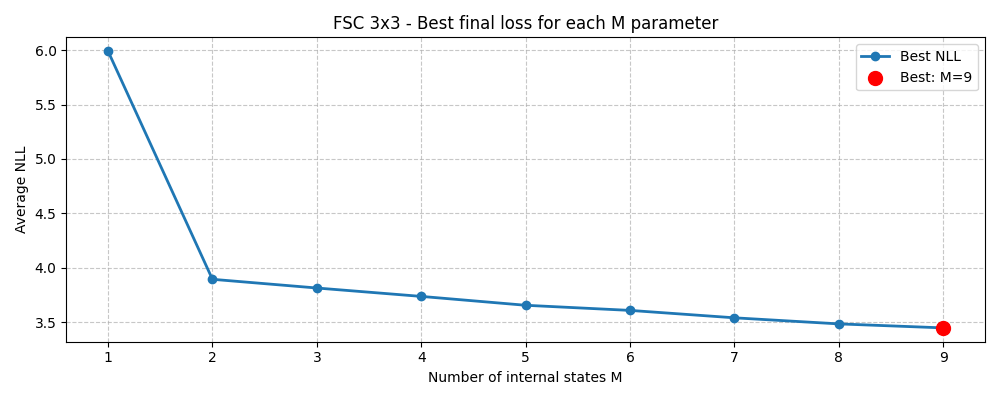
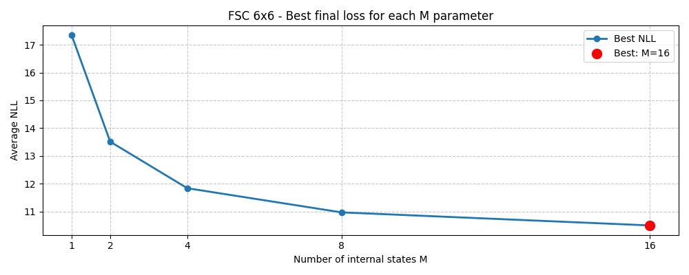   
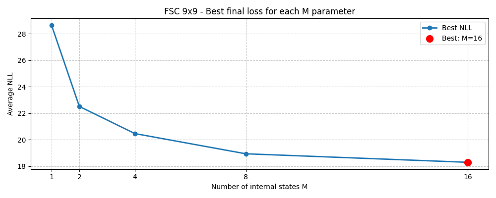   

For the LSTM baseline, I increased the hidden size from 32 to 64 and then to 128 for the 3x3, 6x6, and 9x9 mazes respectively. I used 1 recurrent layer for the 3x3 setting and 2 recurrent layers for the 6x6 and 9x9 settings.

Below are the LSTM training results for the same three maze sizes:

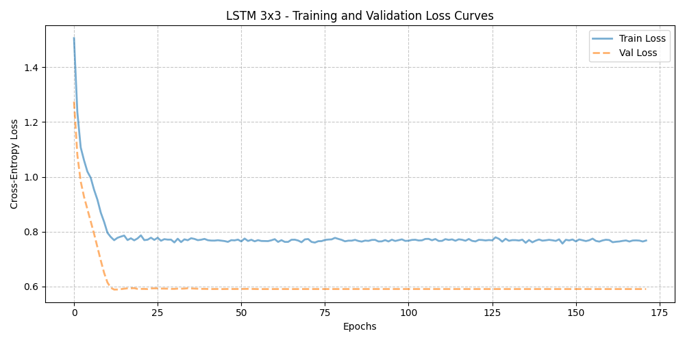
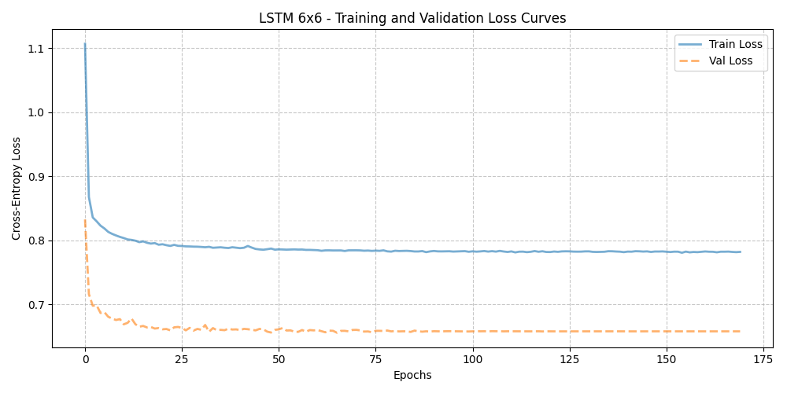
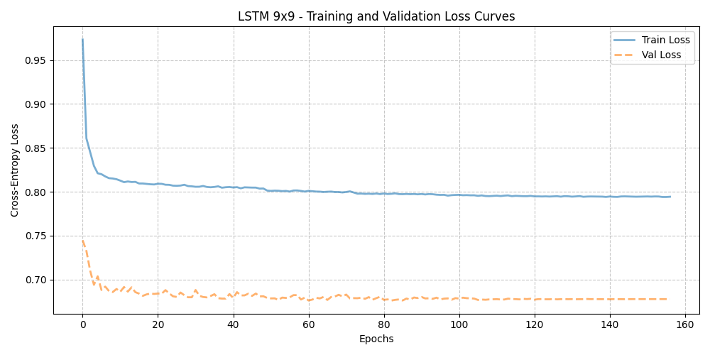

## 🆚 Comparison

In this section, I compare the models across several dimensions:

- Trajectory visualization with a GIF (RPPO, FSC, and LSTM)
- Success rate, average reward, and average episode length (RPPO, FSC, and LSTM)
- Number of parameters (FSC and LSTM)
- Training time and inference time (FSC and LSTM)
- Robustness under action noise (FSC and LSTM)
- Interpretability

For the FSC, I used the version with `M = 4` in the final comparison, since it offered the best trade-off between performance and parameter efficiency.

### 🎯 Optimal trajectories

As shown in the GIF, both RPPO and FSC follow near-optimal trajectories across all three maze sizes. The LSTM, on the other hand, struggles more on the 6x6 and 9x9 mazes, suggesting that imitation alone is less reliable when longer temporal dependencies are required.

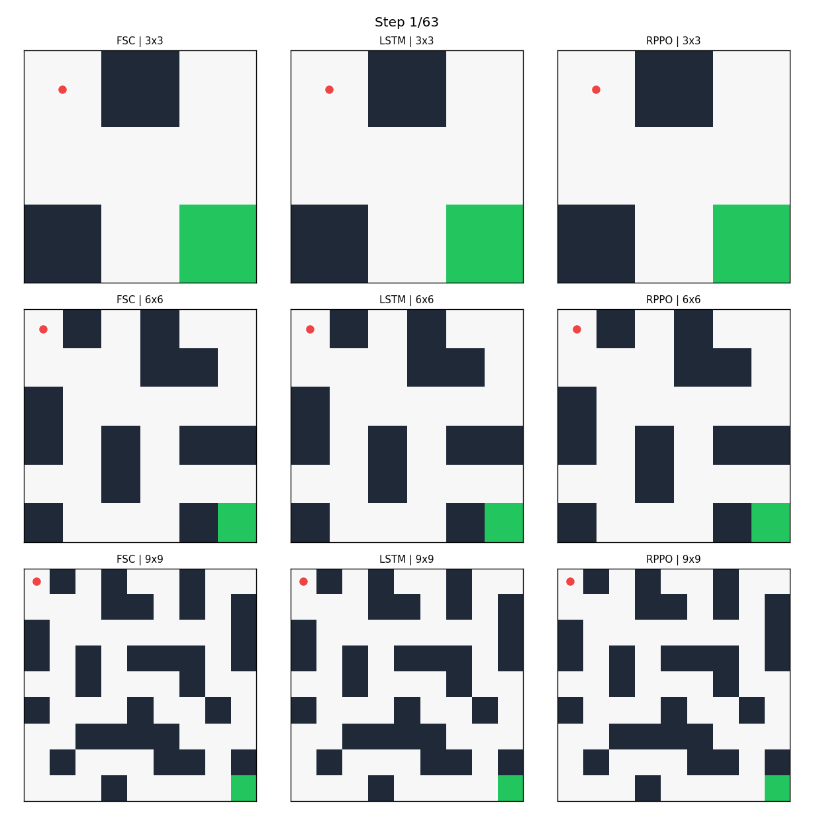

### 🏆 Success rate

The animations already provide a clear indication of the trends that will be confirmed by the quantitative analysis, even before examining any numerical metrics. Both Recurrent PPO and the Finite State Controller (FSC) consistently follow the optimal path, reaching the goal using the minimum possible number of steps in all three maze sizes.

In contrast, the Behavioral Cloning LSTM exhibits a noticeable degradation in performance as the complexity of the environment increases. While it successfully solves the 3×3 maze, it fails to consistently follow the optimal trajectory in the 6×6 and 9×9 environments. In the largest maze, the learned policy even converges to a markedly suboptimal route, requiring approximately 60 steps to reach the goal.

A plausible explanation for this behavior is the increasing length of the trajectories. As the temporal horizon grows, the LSTM must preserve relevant information over a larger number of time steps, making it more difficult to accurately maintain the internal representation required for optimal decision-making. Consequently, small prediction errors can accumulate throughout the episode, eventually causing the policy to deviate from the expert trajectory and follow a longer, less efficient path.

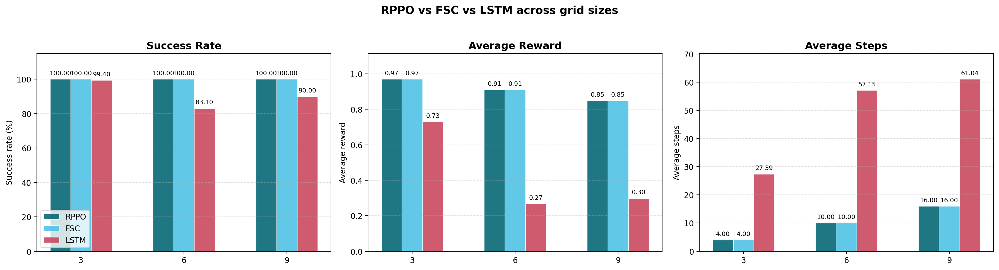

### 🧮 Parameter Count

The table below highlights one of the main advantages of the FSC: it requires far fewer parameters than the LSTM baseline. This does not automatically guarantee better accuracy in every setting, but it strongly improves model compactness and helps explain the lower inference cost. In the table below, an additional metric, Succ-Par, is reported, representing the success rate per trainable parameter. As introduced earlier in this chapter, this efficiency measure is computed for both the FSC and the LSTM models in order to highlight how effectively each architecture utilizes its parameter budget to achieve successful task completion.


| Maze Size | FSC | LSTM | FSC Succ-Par | LSTM Succ-Par |
|-----------|-----|------|--------------|---------------|
| 3x3 | 1,044 | 9,860 | 0,096 | 1,003e-2 |
| 6x6 | 1,044 | 71,428 | 0,096 | 1,103e-3 |
| 9x9 | 1,044 | 282,116 | 0,096 | 2,495e-4 |

FSC uses the same configuration in evaluation across all sizes (M=4, A=4, Y=16), so its parameter count stays constant.

### ⏳ Inference Time

Training the FSC can still take several hours, especially on the 9x9 maze and for larger values of `M` such as 8 or 16. However, since the model already performs very well with `M = 4`, the practical training cost can be reduced substantially. In that setting, training time drops to a much more manageable range.

The LSTM baseline is faster to train, especially when using a GPU. In practice, training the three LSTM models is much quicker than sweeping several FSC configurations.

At inference time, however, the situation is reversed. The FSC is much cheaper per decision step, with response times around $10^{-7}$ seconds, while the LSTM is around $10^{-5}$ seconds. This gap is consistent with the large difference in parameter count.

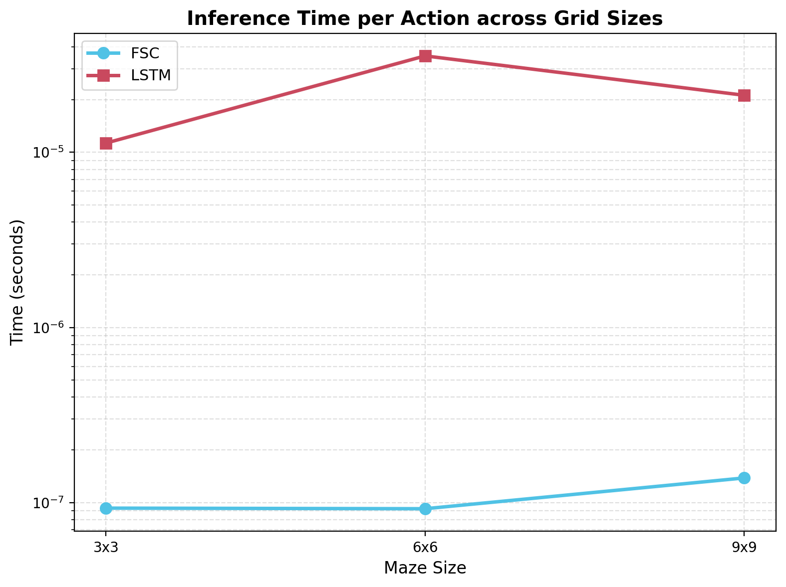

### 💪 Robustness

For the robustness analysis, I introduced action noise: with a given probability, the action executed by the environment differs from the action chosen by the agent.

Below I report the results for randomness levels of 0.1, 0.2, 0.3, 0.4 and 0.5. The FSC remains relatively stable even under fairly high noise levels. It can often recover and still complete the episode, although with a lower reward due to the additional steps.

The LSTM is much more sensitive to this perturbation. Once it is pushed off its nominal trajectory, it tends to accumulate too many extra steps and its reward quickly degrades.

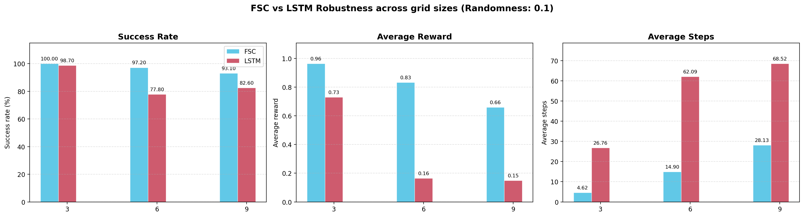
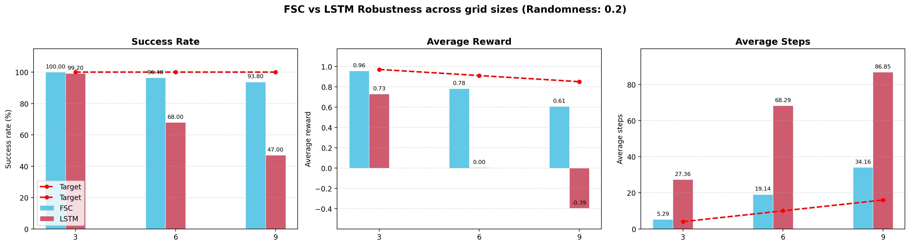
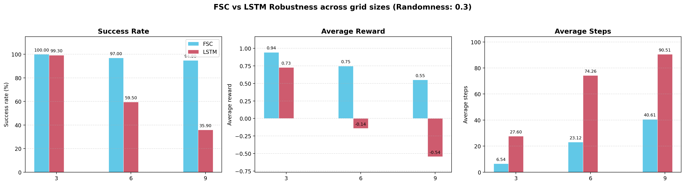

In conclusion, the **FSC** demonstrates strong robustness and reliable recovery capabilities, maintaining stable performance even when repeatedly perturbed away from its optimal trajectory. In contrast, the **LSTM-based Behavioral Cloning model** is considerably more sensitive to small deviations: even under nominal conditions it already tends to drift away from the optimal path, and under perturbations these deviations accumulate, eventually leading to a complete failure in recovering a successful trajectory.

I also tested randomness levels of 0.4 and 0.5. The corresponding plots are available in `./plots/Comparison`.

### 🔤 Interpretability

Interpretability is where the difference between the two approaches becomes most evident. The LSTM is a generic recurrent function approximator trained to minimize imitation loss. While it can learn useful behavior, it does not provide a direct and readable explanation of why a given action is chosen at each step.

For the FSC, the situation is very different. With only four internal states on the 3x3 maze, it is already possible to inspect the learned internal graph and interpret the policy in a meaningful way. In this case, the controller tends to start from `m3`, choose to move down with high probability, then update its internal belief after receiving a new observation and transition to another state from which moving right becomes the dominant action. Step-by-step inspection of the belief updates makes the controller's reasoning transparent in a way that the LSTM cannot match.

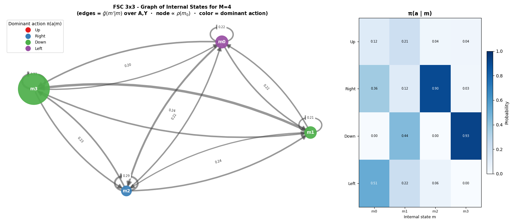

### 🏁 Conclusion

This project suggests that, in this partially observable gridworld, FSCs provide a particularly strong balance between performance, compactness, robustness, and interpretability. When trained on trajectories generated by a recurrent RL expert, a small FSC is able to match the expert and outperform the LSTM imitation baseline on the larger mazes, while using far fewer parameters and substantially lower inference cost.

The LSTM remains a useful baseline because it is flexible, easy to optimize, and faster to train in practice, especially with GPU support. However, its behavior is harder to interpret, less parameter-efficient, and more sensitive when the task requires long-horizon memory or when execution noise perturbs the trajectory.

Overall, the results indicate that if the goal is not only to imitate behavior but also to recover a compact and understandable memory structure, FSCs are a very compelling solution. In contrast, if the priority is fast experimentation with a generic neural architecture, Behavioral Cloning with LSTMs remains a practical alternative, but it offers a weaker explanation of the learned policy.

It is also worth noting that this analysis does not fully do justice to the Behavioral Cloning approach. In particular, LSTM-based imitation learning typically requires significantly more careful hyperparameter tuning and may benefit substantially from larger and more diverse datasets. In such conditions, its performance could potentially become comparable to that of the FSC.

In this work, however, the comparison was intentionally designed to operate under a controlled and shared experimental setting, where both approaches are evaluated using the same amount of data and similar computational constraints. This choice was made in order to ensure a fair and balanced comparison between the two methods, rather than optimizing each model under its own ideal conditions.

Within this framework, the FSC appears to be more naturally suited to the task, demonstrating stronger performance, efficiency, and robustness. Nevertheless, it is important to emphasize that this advantage is not absolute: under different data regimes or with more extensive tuning, the Behavioral Cloning approach could plausibly achieve competitive results and potentially match the performance of the FSC.
